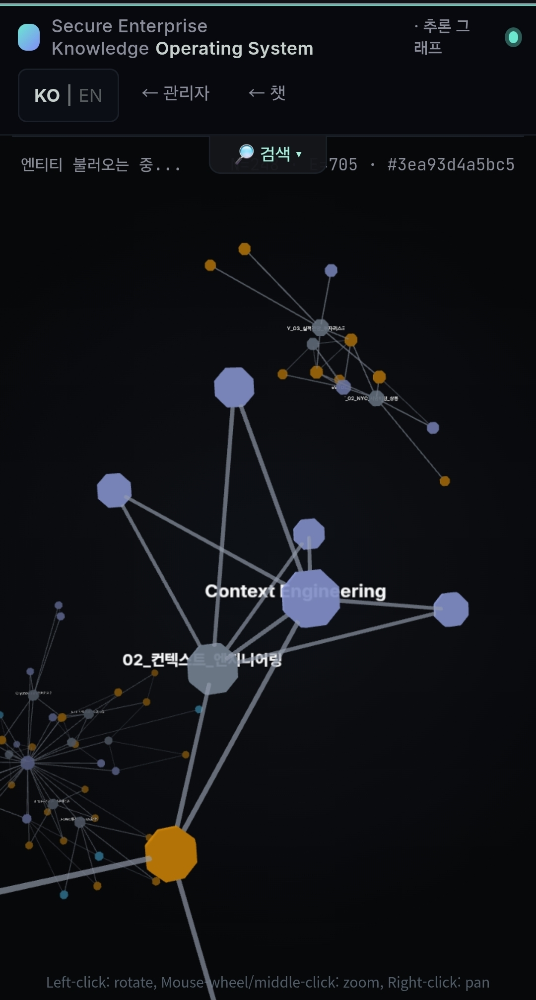

# PROJECT JAMES

> **JAMES** — a local-first, auditable knowledge reasoning platform.
> Graph-RAG retrieval, deterministic contradiction arbitration,
> append-only audit log, replayable knowledge state, and a human
> approval gate for self-evolution. Built as a general
> **mother platform** through v1.0; domain packs (legal, food,
> retail, …) branch off only after v1.0 (see
> [`docs/PLATFORM_READINESS.md`](docs/PLATFORM_READINESS.md)).
>
> **One differentiator highlight**: *Replayable RAG* — the system's
> state at any past point can be reconstructed byte-identically via
> the T7 supersede chain + append-only audit log (`reconstruct_view_at`).
> Other first-class differentiators include Graph-RAG retrieval,
> Knowledge Cascade (Layer 3), Layer 4 Lifecycle (T1–T7), the Plugin
> API, and the deterministic 4-rule contradiction tree.

[](LICENSE)
[](https://github.com/Hashevolution/James-RAG-Evol/releases/tag/v0.4.3)
[]()
[](https://www.bestpractices.dev/projects/12806)
[](https://doi.org/10.5281/zenodo.20426719)
[](eval/rab/SPEC-v0.1.md)



[한국어 README](README.ko.md) · [🚀 처음 시작하시는 분 (10살도 따라할 수 있어요)](README.beginner.ko.md)

---

## What's Verified (one-screen summary)

The numbers below come from the current `main` branch — not aspirational, not from an older release. Every value is reproducible by cloning + running the listed command.

| Surface | Verified | Where to check |
|---|---|---|
| **Test suite** | **3290 tests** collected across `tests/` (224 test files), all green on PR CI | `python -m pytest tests/ --collect-only -q` |
| **CASCADE / EVENT separation** | Provable end-to-end via 5 release-gating invariants run against a real wiki fixture (not mocks) | `tests/test_t7_release_gating_invariants.py` |
| **T6 causality cascade** | 4 additional release-gating invariants pin foundational vs corroborative semantics | `tests/test_t6_release_gating_invariants.py` |
| **QVT 3-axis quality baseline** | path_recall **1.00** / graded_answer **0.58** / abstention_f1 **0.67** (median, post-calibration, N=3 paired reruns) | `eval/qvt/baseline_2a31b20.json` |
| **STEP 7 regression** | 17-query suite with `gold_signals` + `abstention_truth` + `expected_path.nodes` ground truth on 5 queries | `eval/regression/step7_queries.json` v6 |
| **F9 entity-anchor q15 fix** | q15 ("David Soria Parra가 누구야?") path_recall **0.00 → 1.00** after `JAMES_ENABLE_ENTITY_ANCHOR=1` + `JAMES_EMBEDDING_MODEL=BAAI/bge-m3` + `JAMES_ENABLE_QUERY_REWRITE=1` | `reports/research-runs/step7-bench-baseline-run*.json` |
| **Module size discipline** | 20 KB cap enforced on every `core/` file. Largest current: `core/lifecycle/schema.py` at 18.9 KB | CLAUDE.md rule 5 + module-size CI gate |
| **Default-off invariant** | Every routing layer added since v0.3 (D5 / LEO / D1 / T2.D / T6 LLM) defaults OFF — production fleets pulling v0.4.1 see byte-identical retrieval to v0.3.3 unless they opt in | `JAMES_*` env audit (CHANGELOG `[0.4.x]` table) |
| **Deterministic contradiction arbitration** | `classify_contradiction` is an LLM-free 4-rule decision tree (~10.2 KB pure function). Audit-replay-safe by construction. | `core/lifecycle/contradiction_arbiter.py` |
| **RAB v0.1.1 — Replayable-Audit Benchmark** | **JAMES AC/RF/PC = 1.000 / 1.000 / 1.000 vs Baseline-0 (vanilla quickstart + default logging) = 0.275 / 0.000 / 0.000** on scenario-S1. Deterministic scorer (no LLM judge); 3 metrics map to EU AI Act Art. 10/12/19 (in force 2026-08-02). | `eval/rab/SPEC-v0.1.md` + `python scripts/research/rab_run.py --sut {reference,baseline0,james}` |

**What is NOT yet headline-verified**: a single-page ablation card showing **Graph-RAG vs flat RAG** on the same fixture. The infrastructure to produce it (`scripts/qvt_capture_baseline.py` + the 18-cell ablation matrix design from QVT memo §5) is wired; the operator-run capture is the late-June deliverable. Until then, the graph contribution is measurable via `graph_paths_count` per query in any STEP 7 bench output, but not summarized in one table.

---

## Project Status: v0.4.3 — RAB v0.1.1 (Replayable-Audit Benchmark) + Cycle γ multi-hop arc closure

Released **2026-06-10**. v0.4.3 ships **RAB v0.1.1** — the first replayable-audit benchmark for RAG / agent systems whose 3 deterministic metrics (AC / RF / PC) are operationalisations of EU AI Act Articles 10, 12, 19 (in force 2026-08-02). The full SPEC, scenario fixture, scorer, reference / JAMES / Baseline-0 adapters, and 9 measurement artifacts (reports/rab/) are committed. Headline = the **gap structure** across SUTs (JAMES audit-native = 1.000 / 1.000 / 1.000 vs Baseline-0 default-logging floor = 0.275 / 0.000 / 0.000 on scenario-S1), not JAMES's score — SPEC §6.5 explicitly disclaims JAMES-wins framing. Honest framing: **the benchmark is the contribution, not the architecture** — ActiveGraph (arXiv 2605.21997) is independent co-invention of the audit-native runtime; the unfilled gap was the measurement, not the system.

Companion track in the same cycle closes the **Cycle γ multi-hop arc** (PRs #752 → #757) with 6 honest nulls: multi-hop improvement reframed out of the JAMES roadmap; the **graph build O(N²)** secondary finding lifted into RAB as the RF-cost axis.

No JAMES production runtime change — RAB measures the existing audit / lifecycle / graph paths via a workspace-scoped adapter; production `audit.db` is untouched. Default-off invariant preserved.

Pre-v0.4.3: **v0.4.2** (2026-06-06) shipped T5 Replayable Audit Graph — full event-sourced graph-wide reconstruction (`reconstruct_graph_at(t)` audit-only primitive, the building block RAB measures the quality of).

Pre-v0.4.2: **v0.4.1** (2026-05-28) closed the CASCADE pillar that v0.4.0 only half-finished: when a base fact's sources are fully removed, edges whose `derived_from` references that base now auto-invalidate via `invalidate_derived_facts` — the derivation chain stays internally consistent without manual operator intervention. Per-derivation-type semantics (T6.C.b refinement): `transitive` / `inferred` are structural chain links (any base empty → invalidate); `operator` is corroborative (only invalidates when no hard deps AND all operator bases empty).

Pre-v0.4.1: **v0.4.0** (2026-05-27) shipped the Layer 4 first
bundle — **T1 Temporal Validity + T7 Supersede Chain + T2
Contradiction Arbitration** — across an 8-PR Sprint 5 sequence.
The CASCADE vs EVENT separation invariant is **provable end-to-end**
via `tests/test_t7_release_gating_invariants.py`, run against the
actual wiki fixture (not mocks). The supersede chain primitive
(`reconstruct_view_at`) lets the system answer "what was true at
time T?" deterministically, even after destructive CASCADE
operations on unrelated facts.

Pre-v0.4: v0.3.0 (2026-05-17) closed Foundation Hardening — all
six axes (architecture / eval / observability / security /
controlled evolution / real-data validation) green; second-user
validation closed 2026-05-13.

- **NOT production-ready** — operational maturity (HTTPS / SSO /
  multi-tenancy / backup CLI) is a v1.0 deliverable; see
  [SECURITY.md](SECURITY.md)
- Designed with security-first principles end to end
- Open to collaboration — external contributors sign a one-click CLA
  on their first PR (see [License](#license))

---

## Strategic frame: Mother Platform, not a single product

JAMES is **not building one vertical**. It is being hardened as a
"mother platform" from which domain packs (legal, food, retail,
travel, etc.) can branch off **only at v1.0**. Until then:

- No domain-specific features land in `core/`
- Every change is graded against the same six-dimension readiness
  framework (architecture / extension API / eval contract /
  operational maturity / security boundary / production proof)
- The plugin contract that future packs will be built against is
  being designed and stress-tested

See [`docs/PLATFORM_READINESS.md`](docs/PLATFORM_READINESS.md) for
the 6 dimensions, 4 gates (v0.2 / v0.3 / v0.4 / v1.0), and 3
branching forms (Domain Pack / Distribution / Vertical Product).

---

## RAB — Replayable-Audit Benchmark (new in v0.4.3)

**RAB v0.1.1** is a frozen benchmark spec + scenario fixture +
deterministic scorer + adapter contract for systems that claim
audit-replayable RAG / agent state. Three metrics, all deterministic
(no LLM judge anywhere):

* **AC — Audit Completeness** (EU AI Act Art. 12(1)/(2))
* **RF — Replay Fidelity** (Art. 12(2)(b) post-market reconstruction)
* **PC — Provenance Coverage** (Art. 10(2)(b) + W3C PROV)

**Why a new benchmark**: the Mathkar et al. 2026 agent-trace survey
(arXiv 2606.04990) names "realistic execution-trace benchmarks" as
an open challenge; RAB responds to that gap. The benchmark — not the
audit-native runtime — is the contribution: ActiveGraph (arXiv
2605.21997) independently published the event-sourced log + replay
architecture; **RAB is what was missing**.

**Headline = gap structure**, not JAMES's score. Scenario-S1 v0.4.3
result:

| SUT | AC | RF-exact | RF-graded | PC |
|---|---|---|---|---|
| reference (self-verify gate) | 1.000 | 1.000 | 1.000 | 1.000 |
| **JAMES** (audit-native) | **1.000** | **1.000** | 1.000 | **1.000** |
| **Baseline-0** (vanilla quickstart + default logging) | **0.275** | **0.000** | 0.000 | **0.000** |

JAMES = reference on S1 is **expected** (SPEC §6.5). The audit-native
vs default-logging delta is the finding. Honest tier: ⭐⭐
scenario-S1 confirmed. Re-verification triple committed to
`reports/rab/` (SPEC §4 bit-for-bit determinism).

**Not a regulatory certification.** RAB operationalises the AI Act's
*concepts* into measurable form; SPEC §6.3 says so wherever scores
are published.

Reproduce:

```bash
python scripts/research/rab_run.py --sut reference  # 1.000 / 1.000 / 1.000 (gate)
python scripts/research/rab_run.py --sut james      # 1.000 / 1.000 / 1.000
python scripts/research/rab_run.py --sut baseline0  # 0.275 / 0.000 / 0.000
```

See [`eval/rab/SPEC-v0.1.md`](eval/rab/SPEC-v0.1.md),
[`docs/handovers/v0.4-r1-4-gap-table-2026-06-10.md`](docs/handovers/v0.4-r1-4-gap-table-2026-06-10.md),
[`docs/research/r1-4-preregistration-2026-06-10.md`](docs/research/r1-4-preregistration-2026-06-10.md).

---

## What's Different — Replayable RAG

Most RAG systems answer one question: *"what's the answer?"*
JAMES answers two extra:

- **What did the system know at time T?** — T7 supersede chains
  preserve historical fact states; `reconstruct_view_at(t)` returns
  the edge that was active at any past timestamp, even after
  unrelated CASCADE delete events.
- **Why did the system say that?** — every reasoning step (query
  rewrite, retrieval, rerank, planner, reflect, verify, synth)
  writes an append-only audit row. `scripts/replay_trace.py
  <trace_id>` reconstructs the full sequence byte-identically.

The two combined make JAMES a **Replayable RAG** system — a
category distinct from Agentic RAG (which optimises for *what an
AI can do*) and from Mem0-style memory layers (which use an LLM
judge to update beliefs). JAMES updates beliefs via a
deterministic 4-rule decision tree (`core/lifecycle/
contradiction_arbiter.py:classify_contradiction`) that is
LLM-free by design, and preserves both the old and the new fact
for replay rather than overwriting.

### How that's built

1. **Deterministic memory lifecycle** (v0.4.0) — T1 Temporal
   Validity + T7 Supersede Chain + T2 Contradiction Arbitration.
   CASCADE (destructive, Layer 3) and EVENT (history-preserving,
   Layer 4) are guaranteed-separate paths — release-gated by
   `tests/test_t7_release_gating_invariants.py` against the real
   wiki fixture.
2. **Sources-aware Graph-RAG** — 12 typed relations carry semantic
   meaning beyond embeddings, and every relation carries
   `sources: [{doc_id, weight, role, ts}]` so deleting or modifying
   a document surgically updates only the affected derived knowledge
   (Knowledge Cascade A→E, v0.3.0).
3. **Cognitive Layer** — cross-encoder reranker (default ON), LLM
   query rewriter, reflection loop (draft → critique → revise),
   verification engine (security + fact check), and tool router.
   One `trace_id` reconstructs the full 8-stage reasoning sequence
   via `scripts/replay_trace.py`.
4. **PolicyEngine as a layer, not a sprinkle** — single point of
   role / sensitivity decisions wired into retrieval, graph, output,
   and tools; removing it breaks 6+ modules (v0.2 Axis 4).
5. **Change Request primitive** — every write (wiki edits, workspace
   jobs, self-evolution patches) routes through propose → review →
   admin approval → atomic apply → audit row. No silent writes.
6. **Self-evolution behind a human gate** — feedback → candidate →
   bench eval → human approval → deploy → auto-rollback on
   regression. Every deployed patch has an `approver_username`
   audit row (v0.2 Axis 5).
7. **100% local** — runs on a laptop with Ollama; no cloud LLM
   dependency by default.

> Each feature is regression-tested against the STEP 7 13-query
> baseline + RAGAS metrics. PRs touching `core/{retrieval,graph,reasoning}`
> cannot land without bench numbers.

---

## Quick Start

### Prerequisites

- Python 3.11+
- [Ollama](https://ollama.ai) installed and running
- Min 16GB RAM (32GB+ recommended)
- (Optional) NVIDIA GPU for faster inference
- (Optional) Tavily API key for web search ([free 1k/month](https://tavily.com))

### Installation

```bash
git clone https://github.com/Hashevolution/James-RAG-Evol
cd James-RAG-Evol

# Configure environment
cp .env.example .env
# Edit .env — set JAMES_API_KEY, JAMES_JWT_SECRET

# Install dependencies
pip install -r requirements.txt

# Start the server (admin wizard auto-recommends a model on first login)
python server_llmwiki.py
```

Open `http://localhost:8000/admin` — the admin wizard measures your
hardware and offers a one-click install of an appropriate Ollama
model. Then open `http://localhost:8000` for the chat UI.

---

## Architecture

```
[User Query]
     ↓
[Security Filter]      ← injection patterns + PolicyEngine pre-check
     ↓
[Query Router]         ← chat / coding / retrieval / web_search
     ↓
[Query Rewriter]       ← LLM rewrite (opt-in, JAMES_ENABLE_QUERY_REWRITE)
     ↓
[Hybrid Search]        ← Vector(60%) + BM25(20%) + keyword(10%) + name(10%)
     ↓
[Cross-Encoder Rerank] ← MiniLM-L-6-v2 (default ON; JAMES_DISABLE_RERANK=1 to disable)
     ↓
[Graph Engine]         ← DFS + sources-aware + sensitivity gating
     ↓
[Reasoning Loop]       ← retrieve → expand → reflect (opt-in) → verify (opt-in)
     ↓
[Tool Router]          ← read tools direct; write tools → Change Request
     ↓
[Output Filter]        ← PII masking + role-based filter
     ↓
[Answer + Reasoning Path + trace_id]
```

Every stage emits a row tied to one `trace_id`.
`scripts/replay_trace.py <trace_id>` reconstructs the full sequence
from `audit_log`. See [`docs/ARCHITECTURE.md §5.7`](docs/ARCHITECTURE.md)
for the Cognitive Layer design.

---

## Folder Structure

```
James-RAG-Evol/
├── core/
│   ├── reasoning/        retrieval/reflection/verification/tool router
│   ├── retrieval/        hybrid search + cross-encoder reranker + query rewriter
│   ├── memory/           long-term memory (db / conversation / summaries)
│   ├── plugins/          plugin contract surface (Provider Protocol)
│   ├── policy_engine.py  single point of role/sensitivity decisions
│   ├── change_request.py propose/review/approve write primitive
│   ├── cascade.py        file delete/modify → graph surgical update
│   ├── graph_editor.py   edge edit (replace/append/delete) + bidirectional sync
│   └── ...
├── eval/                 STEP 7 regression baseline + RAGAS suite
├── llm/                  LLM provider abstraction
├── tools/                Capability-token gated tool modules
├── frontend/             Web UI (HTML + JS)
├── processors/           File preprocessing
├── wiki/                 Knowledge graph (markdown + sources)
├── memory/               Long-term memory DB
├── workspace/            Change requests, patches, proposals
├── scripts/              bench.py / replay_trace.py / ops scripts
├── reports/              Eval results + promo assets
├── docs/                 ARCHITECTURE / PLATFORM_READINESS / ROADMAP / handovers
└── server_llmwiki.py     Main server entry point
```

---

## Security Approach

JAMES treats security as a **design principle, not a feature**:

- **3-stage access control**: Vector → Graph → Output
- **RBAC** (4 roles) + **ABAC** (4 sensitivity levels)
- **Instruction isolation**: separates commands from data
- **JWT auth** + rate limiting + full audit log
- **Sandboxed execution** (for tool calls)

> Realistic note: synthetic-data testing differs from adversarial production testing. See [SECURITY.md](SECURITY.md).

---

## Current Features

| Feature | Status |
|---------|--------|
| Hybrid Search (Vector + BM25 + keyword + name) | Working |
| Cross-encoder reranker (MiniLM-L-6-v2) | Working — default ON (v0.3) |
| LLM query rewriter | Opt-in (v0.3) |
| Sources-aware Graph-RAG (Knowledge Cascade A→E) | Working (v0.3) |
| PolicyEngine (RBAC + ABAC + capability tokens) | Working (v0.2 Axis 4) |
| Reflection loop (draft → critique → revise) | Opt-in (v0.3) |
| Verification engine (security + fact check) | Opt-in (v0.3) |
| Tool router (read direct, write → Change Request) | Working (v0.3) |
| Change Request primitive (wiki + jobs + patches) | Working (v0.2.x + v0.3) |
| Self-evolution (human approval + auto-rollback) | Working (v0.2 Axis 5) |
| Trace replay (one `trace_id` → full reasoning seq) | Working (v0.3) |
| Multimodal (image/video/audio + OCR-poison quarantine) | Working (v0.2 Axis 4) |
| Web search (Tavily / DuckDuckGo fallback) | Working |
| Multi-LLM routing (Ollama + Claude CLI backends) | Working |
| STEP 7 regression baseline + RAGAS | Working (v0.2 Axis 2) |
| Real-data validation (second-user gate) | Passed 2026-05-13 |

---

## Tech Stack

- **Backend**: FastAPI + Uvicorn
- **LLM**: Ollama (Gemma, DeepSeek-Coder, LLaVA)
- **Vector DB**: ChromaDB
- **Embedding**: Sentence-Transformers (MiniLM)
- **Search**: BM25 + Vector hybrid
- **Web search**: Tavily (primary) + DuckDuckGo (fallback)
- **Auth**: JWT (python-jose)
- **Storage**: SQLite + markdown wiki

---

## Roadmap

See [ROADMAP.md](ROADMAP.md) and [`docs/PLATFORM_READINESS.md`](docs/PLATFORM_READINESS.md).
Summary:

- **v0.1**: Core engine + scaffolding (released)
- **v0.2**: Foundation Hardening — 6 axes (closed 2026-05-13)
- **v0.3**: Platform Skeleton — Cognitive Layer + Knowledge Cascade
  + Change Request primitive (current; released 2026-05-17)
- **v0.4**: First Domain Pilot — one pack + one external customer,
  6-month no-regression
- **v1.0**: Production-Grade Mother — HTTPS / SSO / multi-tenancy /
  SOC2 readiness; external developers can publish their own packs

Multi-agent specialists, optional Neo4j backend, OpenAI-compatible
API, streaming responses, and federation are speculative Beyond
v1.0 work — see [`ROADMAP.md` §Beyond v1.0](ROADMAP.md).

---

## Contributing

Welcome! See [CONTRIBUTING.md](CONTRIBUTING.md).

Priority areas:
- Documentation, examples, translations
- Bug fixes, test coverage
- New tool integrations and LLM provider support

---

## License

**Licensed under the MIT License.** Use freely. See [LICENSE](LICENSE).

External contributors sign a one-click
[Contributor License Agreement](docs/legal/CLA.md) on their first pull
request (CLA Assistant). One signature covers all future contributions
to the project. See [CONTRIBUTING.md](CONTRIBUTING.md#license--contributor-license-agreement-cla)
for the full §License & CLA section, and
[docs/legal/non-cla-contributions.md](docs/legal/non-cla-contributions.md)
for contribution paths that don't require signing.

A full inventory of third-party dependency licenses is available in
[THIRD_PARTY_LICENSES.md](THIRD_PARTY_LICENSES.md).

---

## Acknowledgements

Inspired by:
- [Microsoft GraphRAG](https://github.com/microsoft/graphrag)
- [LightRAG](https://github.com/HKUDS/LightRAG)
- [Graphiti](https://github.com/getzep/graphiti)
- Palantir-style ontology approaches
- Architectural direction, Platform Readiness gates, and roadmap framing are discussed with LEO, continuing collaborator on this work

---

## Disclaimer

**Use at your own risk.** This is research code. No guarantees regarding sensitive-data handling or production security without further hardening.
