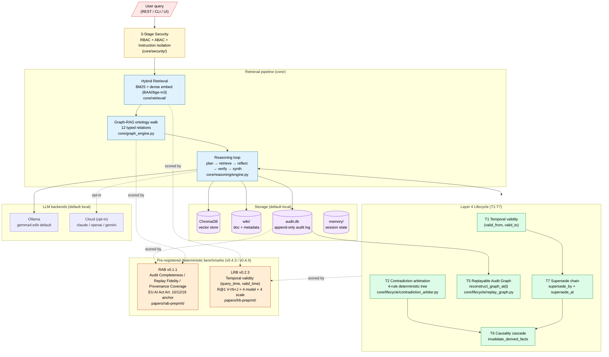

# SEKOS — Secure Enterprise Knowledge Operating System

> A local-first, auditable knowledge platform with Graph-RAG retrieval,
> deterministic contradiction arbitration, an append-only audit log, and
> replayable knowledge state. Its one differentiator: **Replayable RAG** —
> the system's state at any past point can be reconstructed byte-identically
> from the audit log alone (`reconstruct_graph_at(t)`).
>
> Built as a general **mother platform** through v1.0; domain packs (legal,
> food, retail, …) branch off only after v1.0 (see
> [`docs/PLATFORM_READINESS.md`](docs/PLATFORM_READINESS.md)).

[](LICENSE)
[](https://github.com/Hashevolution/James-RAG-Evol/blob/main/docs/handovers/v0.5-close-2026-06-12.md)
[]()
[](https://www.bestpractices.dev/projects/12806)
[](https://doi.org/10.5281/zenodo.20652679)
[](eval/rab/SPEC-v0.1.md)
[](papers/lrb-preprint/main.pdf)


[한국어 README](README.ko.md) · [🚀 처음 시작하시는 분 (10살도 따라할 수 있어요)](README.beginner.ko.md)

> **A note on naming.** **SEKOS** is the product brand (UI, marketing, product
> framing). **JAMES** is the internal codename for the reasoning engine inside
> it — the RAG + audit + lifecycle core. The repository, source comments,
> environment variables (`JAMES_*`), CLI flags (`--sut james`), the two
> benchmarks (RAB / LRB), and the citation BibTeX all keep the JAMES name
> because the published artifacts (Zenodo DOI, preprints, SPECs) were
> registered under it and must stay reproducible. Read SEKOS on the sidebar;
> read JAMES in `grep -r '^# ' core/`.

---

## Why SEKOS? (60-second scan)

Most production RAG stacks today (LangChain, LlamaIndex, vanilla retrieval-augmented quickstarts) optimise for **answer quality on a frozen corpus**. SEKOS — running the JAMES reasoning engine — is built for the next two axes those frameworks leave unmeasured:

| Axis | LangChain / LlamaIndex / vanilla RAG | **SEKOS (JAMES engine)** |
|---|---|---|
| **Audit-native lifecycle** | `logger.info()` strings; no canonical event taxonomy; replay impossible from logs alone | Event-sourced `audit_log` schema; `reconstruct_graph_at(t)` replays system state byte-identically from log alone — measured on **RAB v0.1.1** (AC/RF/PC = 1.0 × 3 vs Baseline-0 default-logging floor = 0.275/0/0) |
| **Time-valid retrieval** | Latest version only; cannot answer *"what was this contract's clause 6 months ago?"* without an external versioned store | Per-document validity windows (T1) + supersede chain (T7); time-travel queries return the version valid at `query_time` — measured on **LRB v0.2.3** (R@1 Vanilla < Naive < JAMES preserved across 4 models × 4 scales, JAMES − Naive gap > +0.10 throughout) |
| **Local-first execution** | Cloud-default (OpenAI / Anthropic API calls in every retrieval) | Runs on local Ollama (gemma4:e4b 4B → mxtral 47B); cloud is opt-in per query; data never leaves the host without explicit consent |
| **EU AI Act 2026-08 alignment** | "Compliance" is a TODO | RAB's 3 metrics map verbatim to Articles 10/12/19; the benchmark is the audit instrument the Act assumes exists |

What SEKOS does **not** claim:
- **Better answer quality on closed-book QA** — not *better*, but **measured parity**: Vanilla, Naive, and JAMES produce 4-decimal-identical EM/F1 on MuSiQue (gemma4:e4b / gemma3:12b / mxtral 47B), so JAMES adds **no reasoning degradation**. The closed-book score is the backbone model's capability; the validity-window mechanism is retrieval-side and orthogonal to closed-book reasoning. See [LRB preprint](papers/lrb-preprint/main.pdf) §5.5.
- **Novel architecture** — ActiveGraph ([arXiv:2605.21997](https://arxiv.org/abs/2605.21997)) demonstrates the same event-sourced runtime class independently; the benchmark, not the runtime, is the contribution.
- **Drop-in LangChain replacement** — SEKOS is a *platform* with a different operational model (audit-first); migration is an integration project, not a one-line `pip install`.

If your use case is *audit / lifecycle / time-travel / on-prem* — SEKOS is built for it, measured for it, and citeable for it. If your use case is *fastest possible answer on a fixed corpus* — use LangChain.

> **Looking for MRR / NDCG / RAGAS / hallucination-rate coverage?** See [`docs/evaluation/v0.5-evaluation-coverage-mapping.md`](docs/evaluation/v0.5-evaluation-coverage-mapping.md) — a full mapping of standard RAG / IR metrics to what SEKOS measures (and what it deliberately doesn't), including code paths and procurement-ready answers.
>
> **Looking for a one-page comparison vs LangChain / LlamaIndex / Haystack / R2R / ActiveGraph?** See [`docs/evaluation/v0.5-industry-comparison.md`](docs/evaluation/v0.5-industry-comparison.md) — three matrices (architectural capability presence / public benchmark headline coverage / reproducibility tier) with every SEKOS cell pinned to a committed artifact.

---

## Quick Start

### Prerequisites

- Python 3.11+
- [Ollama](https://ollama.ai) installed and running
- Min 16GB RAM (32GB+ recommended)
- (Optional) NVIDIA GPU for faster inference
- (Optional) Tavily API key for web search ([free 1k/month](https://tavily.com))

### Installation

```bash
git clone https://github.com/Hashevolution/James-RAG-Evol
cd James-RAG-Evol

# Configure environment
cp .env.example .env
# Edit .env — set JAMES_API_KEY, JAMES_JWT_SECRET

# Install dependencies
pip install -r requirements.txt

# Start the server (admin wizard auto-recommends a model on first login)
python server_llmwiki.py
```

Open `http://localhost:8000/admin` — the admin wizard measures your
hardware and offers a one-click install of an appropriate Ollama
model. Then open `http://localhost:8000` for the chat UI.

> Want to reproduce the published benchmark numbers instead of running the
> product? Jump to [Reproduce in 60 seconds](#reproduce-in-60-seconds).

---

## Architecture



**The flow in one sentence**: a user query passes through 3-stage security (RBAC + ABAC + instruction isolation), enters the retrieval pipeline (hybrid BM25 + dense embed → Graph-RAG ontology walk → reasoning loop), reads + writes the Layer 4 lifecycle store (T1-T7), and is replayable from the audit log via `reconstruct_graph_at(t)`. RAB scores the audit log; LRB scores the retrieval quality on time-travel queries. Both benchmarks are external deterministic instruments — JAMES does not score itself.

### Request pipeline (stage by stage)

```
[User Query]
     ↓
[Security Filter]      ← injection patterns + PolicyEngine pre-check
     ↓
[Query Router]         ← chat / coding / retrieval / web_search
     ↓
[Query Rewriter]       ← LLM rewrite (opt-in, JAMES_ENABLE_QUERY_REWRITE)
     ↓
[Hybrid Search]        ← Vector(60%) + BM25(20%) + keyword(10%) + name(10%)
     ↓
[Cross-Encoder Rerank] ← MiniLM-L-6-v2 (default ON; JAMES_DISABLE_RERANK=1 to disable)
     ↓
[Graph Engine]         ← DFS + sources-aware + sensitivity gating
     ↓
[Reasoning Loop]       ← retrieve → expand → reflect (opt-in) → verify (opt-in)
     ↓
[Tool Router]          ← read tools direct; write tools → Change Request
     ↓
[Output Filter]        ← PII masking + role-based filter
     ↓
[Answer + Reasoning Path + trace_id]
```

Every stage emits a row tied to one `trace_id`.
`scripts/replay_trace.py <trace_id>` reconstructs the full sequence
from `audit_log`. See [`docs/ARCHITECTURE.md §5.7`](docs/ARCHITECTURE.md)
for the Cognitive Layer design.

### Folder structure

```
James-RAG-Evol/
├── core/
│   ├── reasoning/        retrieval/reflection/verification/tool router
│   ├── retrieval/        hybrid search + cross-encoder reranker + query rewriter
│   ├── memory/           long-term memory (db / conversation / summaries)
│   ├── plugins/          plugin contract surface (Provider Protocol)
│   ├── policy_engine.py  single point of role/sensitivity decisions
│   ├── change_request.py propose/review/approve write primitive
│   ├── cascade.py        file delete/modify → graph surgical update
│   ├── graph_editor.py   edge edit (replace/append/delete) + bidirectional sync
│   └── ...
├── eval/                 STEP 7 regression baseline + RAGAS suite
├── llm/                  LLM provider abstraction
├── tools/                Capability-token gated tool modules
├── frontend/             Web UI (HTML + JS)
├── processors/           File preprocessing
├── wiki/                 Knowledge graph (markdown + sources)
├── memory/               Long-term memory DB
├── workspace/            Change requests, patches, proposals
├── scripts/              bench.py / replay_trace.py / ops scripts
├── reports/              Eval results + promo assets
├── docs/                 ARCHITECTURE / PLATFORM_READINESS / ROADMAP / handovers
└── server_llmwiki.py     Main server entry point
```

---

## What's Different — Replayable RAG

Most RAG systems answer one question: *"what's the answer?"*
SEKOS answers two extra:

- **What did the system know at time T?** — T7 supersede chains
  preserve historical fact states; `reconstruct_view_at(t)` returns
  the edge that was active at any past timestamp, even after
  unrelated CASCADE delete events.
- **Why did the system say that?** — every reasoning step (query
  rewrite, retrieval, rerank, planner, reflect, verify, synth)
  writes an append-only audit row. `scripts/replay_trace.py
  <trace_id>` reconstructs the full sequence byte-identically.

The two combined make SEKOS a **Replayable RAG** system — a
category distinct from Agentic RAG (which optimises for *what an
AI can do*) and from Mem0-style memory layers (which use an LLM
judge to update beliefs). SEKOS updates beliefs via a
deterministic 4-rule decision tree (`core/lifecycle/contradiction_arbiter.py`)
that is LLM-free by design, and preserves both the old and the new
fact for replay rather than overwriting.

### How that's built

1. **Deterministic memory lifecycle** (v0.4.0) — T1 Temporal
   Validity + T7 Supersede Chain + T2 Contradiction Arbitration.
   CASCADE (destructive, Layer 3) and EVENT (history-preserving,
   Layer 4) are guaranteed-separate paths — release-gated by
   `tests/test_t7_release_gating_invariants.py` against the real
   wiki fixture.
2. **Sources-aware Graph-RAG** — 12 typed relations carry semantic
   meaning beyond embeddings, and every relation carries
   `sources: [{doc_id, weight, role, ts}]` so deleting or modifying
   a document surgically updates only the affected derived knowledge
   (Knowledge Cascade A→E, v0.3.0).
3. **Cognitive Layer** — cross-encoder reranker (default ON), LLM
   query rewriter, reflection loop (draft → critique → revise),
   verification engine (security + fact check), and tool router.
   One `trace_id` reconstructs the full 8-stage reasoning sequence
   via `scripts/replay_trace.py`.
4. **PolicyEngine as a layer, not a sprinkle** — single point of
   role / sensitivity decisions wired into retrieval, graph, output,
   and tools; removing it breaks 6+ modules (v0.2 Axis 4).
5. **Change Request primitive** — every write (wiki edits, workspace
   jobs, self-evolution patches) routes through propose → review →
   admin approval → atomic apply → audit row. No silent writes.
6. **Self-evolution behind a human gate** — feedback → candidate →
   bench eval → human approval → deploy → auto-rollback on
   regression. Every deployed patch has an `approver_username`
   audit row (v0.2 Axis 5).
7. **100% local** — runs on a laptop with Ollama; no cloud LLM
   dependency by default.

> Each feature is regression-tested against the STEP 7 20-query
> baseline + RAGAS metrics. PRs touching `core/{retrieval,graph,reasoning}`
> cannot land without bench numbers.

---

## What does Graph-RAG contribute?

A single 4-cell ablation on the `multihop_rag` fixture (N=100, n=3 paired runs, on the 4B local model gemma4:e4b, git commit `b686f35`):

| Cell | path_coverage | graded_answer | abstention_f1 | token_cost | latency |
|---|---|---|---|---|---|
| C_minus (no RAG) | 0.000 | 0.213 | 0.356 | 675 | 9.8s |
| C_rag-basic (+ vector) | 0.000 | 0.260 | 0.306 | 783 | 12.5s |
| **C_rag-graph (+ graph)** | **0.4056** | 0.203 | 0.400 | 1675 | 32.4s |
| C_rag-ontology (+ typed filter) | 0.4056 | 0.230 | 0.4286 | 1695 | 32.4s |

**Graph-RAG contribution** (C_rag-basic → C_rag-graph):
- **path_coverage +0.41** (load-bearing win, noise band 0.02) — vector-only retrieval recovers 0% of gold supporting-doc paths on multi-hop queries; graph traversal recovers ~40%.
- abstention_f1 +0.094 (graph evidence improves "when to say I don't know" calibration).
- graded_answer −0.057 (honest loss — graph evidence adds noise to short-answer queries; typed-filter recovers +0.027).
- **2.1× token cost, 2.6× latency** (the path-coverage win is not free).

**Cross-time reproducibility**: an earlier measurement cycle (2026-06-01, single run) measured path_coverage 0.408; this rerun (2026-06-13, n=3 median) confirms 0.4056. **Stable across 12 days of oracle revisions.**

Full table + LRB architecture ablation + RAB audit ablation + honest negatives (closed-book QA, deep-multi-hop floor, cost trade-offs) all in [`docs/evaluation/v0.5-graph-rag-contribution.md`](docs/evaluation/v0.5-graph-rag-contribution.md).

---

## Papers & Reproducibility

Two benchmarks released as a sibling pair, both pre-registered before measurement, both deterministic-scorer-only (no LLM judge), both committed in this repository.

> **Evidence tiers** used throughout this README: **⭐⭐⭐** = pattern holds across models, scales, and reruns (strongest); **⭐⭐** = confirmed in the tested scenario but absolute magnitude is scenario-sensitive; **⭐** = infrastructure exists / single-model or single-run only, not yet research-tier.

### RAB v0.1.1 — Replayable-Audit Benchmark
[📄 PDF (10 pages)](papers/rab-preprint/main.pdf) · [📋 SPEC](eval/rab/SPEC-v0.1.md) · [🧪 Reproduce](#reproduce-in-60-seconds)

> *RAB scores the exported audit-log artifact (Audit Completeness / Replay Fidelity / Provenance Coverage) of any RAG or agent system that can dump an append-only log. Three metrics map verbatim to EU AI Act Articles 10, 12, 19. Headline: the 4-SUT gap structure (Reference / JAMES audit-native / OpenTelemetry-GenAI bolt-on / vanilla default-logging) — not JAMES's absolute score.*

### LRB v0.2.3 — Lifecycle Retrieval Benchmark
[📄 PDF (11 pages)](papers/lrb-preprint/main.pdf) · [🧪 Reproduce](#reproduce-in-60-seconds)

> *LRB scores temporal-validity (`query_time`, `valid_time`) retrieval quality across three deterministic scenarios (S1 quarterly, S2 yearly-with-time-travel, S3 publication-scale 1000 docs). Three systems-under-test (Vanilla append-only / Naive-supersede / JAMES validity-window) compared on 7 deterministic axes + 3 exploratory top-1 axes. Headline: Vanilla < Naive < JAMES on R@1 preserved across **4 model families × 4 scale points** (12.5× scale span) with the JAMES − Naive gap > +0.10 throughout.*

### Reproduce in 60 seconds

**One command** (wraps everything below; deterministic core tier, no GPU/Ollama, ~2 min):

```bash
git clone https://github.com/Hashevolution/James-RAG-Evol.git
cd James-RAG-Evol
python -m pip install -r requirements.txt
bash benchmarks/run_all.sh        # see benchmarks/README.md for --full / --with-llm
```

<details>
<summary>Or run each benchmark by hand</summary>

```bash
# RAB scenario-S1 (deterministic; no LLM call; ~5 seconds)
python scripts/research/rab_run.py --sut reference     # AC/RF/PC = 1.000/1.000/1.000 (gate)
python scripts/research/rab_run.py --sut james         # AC/RF/PC = 1.000/1.000/1.000
python scripts/research/rab_run.py --sut baseline0     # AC/RF/PC = 0.275/0.000/0.000

# LRB Phase B (S2 time-travel) token-mode (deterministic; no LLM; ~30 seconds)
# Scenario fixtures are gitignored — build them first (deterministic, no LLM):
python scripts/research/build_lrb_scenario_s1.py
python scripts/research/build_lrb_scenario_s2.py
PYTHONPATH=. python scripts/research/lrb_run_phase_b.py --scenarios S1,S2
#   → S2 R@1: Vanilla 0.225 < Naive 0.538 < JAMES 0.688 (JAMES − Naive gap +0.15)

# LRB S3 publication-scale (1000 docs / 5.6k events / 1000 queries; ~3 minutes)
python scripts/research/build_lrb_scenario_s3.py --scale publication
python scripts/research/lrb_run_s3.py --scale publication
```

</details>

Every `result.json` + `bench.jsonl` artifact in `reports/external/lrb/` and `reports/rab/` is SHA-pinned against the scenario fixture; **byte-identical re-runs are the verification protocol**. Full reproducibility disclosure + the community reproduction program live in [`benchmarks/`](benchmarks/README.md).

### Citation (BibTeX)

<details>
<summary>Click to expand</summary>

```bibtex
@misc{seo2026jamesv044,
  author    = {Seo, Jiwon},
  title     = {{PROJECT JAMES} v0.4.4 (LRB v0.2.3 S3 publication-scale + cycle $\gamma$ 4-bench infrastructure closure)},
  year      = {2026},
  month     = {6},
  doi       = {10.5281/zenodo.20652679},
  url       = {https://doi.org/10.5281/zenodo.20652679},
  version   = {v0.4.4},
  publisher = {Zenodo},
  note      = {Source: https://github.com/Hashevolution/James-RAG-Evol}
}

@misc{seo2026rab,
  author        = {Seo, Jiwon},
  title         = {{RAB}: A Replayable-Audit Benchmark for {RAG} and Agent Systems Operationalising {EU AI Act} Articles 10, 12, 19},
  year          = {2026},
  howpublished  = {Preprint v0.1.1},
  url           = {papers/rab-preprint/main.pdf},
  note          = {Data: \href{https://doi.org/10.5281/zenodo.20652679}{10.5281/zenodo.20652679}}
}

@misc{seo2026lrb,
  author        = {Seo, Jiwon},
  title         = {{LRB}: A Lifecycle Retrieval Benchmark for Temporal {RAG}},
  year          = {2026},
  howpublished  = {Preprint v0.2.3},
  url           = {papers/lrb-preprint/main.pdf},
  note          = {Data: \href{https://doi.org/10.5281/zenodo.20652679}{10.5281/zenodo.20652679}}
}
```

</details>

---

## RAB in depth — the AI Act mapping

**RAB v0.1.1** is a frozen benchmark spec + scenario fixture +
deterministic scorer + adapter contract for systems that claim
audit-replayable RAG / agent state. Three metrics, all deterministic
(no LLM judge anywhere), each tied to a specific EU AI Act article:

| Metric | What it measures | EU AI Act anchor |
|---|---|---|
| **AC — Audit Completeness** | Are all required events present in the log? | Art. 12(1)/(2) |
| **RF — Replay Fidelity** | Can past state be reconstructed exactly from the log? | Art. 12(2)(b) post-market reconstruction |
| **PC — Provenance Coverage** | Is every fact traceable to its source? | Art. 10(2)(b) + W3C PROV |

**Why a new benchmark**: the Mathkar et al. 2026 agent-trace survey
([arXiv:2606.04990](https://arxiv.org/abs/2606.04990)) names "realistic execution-trace benchmarks" as
an open challenge; RAB responds to that gap. The benchmark — not the
audit-native runtime — is the contribution: ActiveGraph
([arXiv:2605.21997](https://arxiv.org/abs/2605.21997)) independently published the event-sourced log + replay
architecture; **RAB is what was missing**.

**Headline = the gap structure**, not the JAMES engine's score (scenario-S1):

| SUT | AC | RF-exact | RF-graded | PC |
|---|---|---|---|---|
| reference (self-verify gate) | 1.000 | 1.000 | 1.000 | 1.000 |
| **JAMES** (audit-native) | **1.000** | **1.000** | 1.000 | **1.000** |
| **Baseline-0** (vanilla quickstart + default logging) | **0.275** | **0.000** | 0.000 | **0.000** |

JAMES matching the reference on S1 is **expected** (SPEC §6.5). The audit-native
vs default-logging delta is the finding. Evidence tier: **⭐⭐** (scenario-S1
confirmed). **Not a regulatory certification** — RAB operationalises the AI Act's
*concepts* into measurable form; SPEC §6.3 says so wherever scores are published.

See [`eval/rab/SPEC-v0.1.md`](eval/rab/SPEC-v0.1.md),
[`docs/handovers/v0.4-r1-4-gap-table-2026-06-10.md`](docs/handovers/v0.4-r1-4-gap-table-2026-06-10.md),
and [`docs/research/r1-4-preregistration-2026-06-10.md`](docs/research/r1-4-preregistration-2026-06-10.md).

---

## What's Verified (one-screen summary)

The numbers below come from the current `main` branch — not aspirational, not from an older release. Every value is reproducible by cloning + running the listed command. (See the [Evidence tiers](#papers--reproducibility) legend for the ⭐ notation.)

| Surface | Verified | Where to check |
|---|---|---|
| **Test suite** | **4998 tests** collected across `tests/` (333 test files), all green on PR CI | `python -m pytest tests/ --collect-only -q` |
| **CASCADE / EVENT separation** | Provable end-to-end via 5 release-gating invariants run against a real wiki fixture (not mocks) | `tests/test_t7_release_gating_invariants.py` |
| **T6 causality cascade** | 4 additional release-gating invariants pin foundational vs corroborative semantics | `tests/test_t6_release_gating_invariants.py` |
| **Quality baseline (3-axis)** | path_recall **1.00** / graded_answer **0.58** / abstention_f1 **0.67** (median, post-calibration, n=3 paired reruns) | `eval/qvt/baseline_2a31b20.json` |
| **STEP 7 regression** | 20-query suite with `gold_signals` + `abstention_truth` + `expected_path.nodes` ground truth | `eval/regression/step7_queries.json` (step7-v7) |
| **Entity-anchor q15 fix** | q15 ("David Soria Parra가 누구야?") path_recall **0.00 → 1.00** after `JAMES_ENABLE_ENTITY_ANCHOR=1` + `JAMES_EMBEDDING_MODEL=BAAI/bge-m3` + `JAMES_ENABLE_QUERY_REWRITE=1` | `reports/research-runs/step7-bench-baseline-run*.json` |
| **Module size discipline** | 20 KB cap enforced on every NEW `core/` file (CLAUDE.md rule #5). Five legacy modules are grandfathered above the cap (largest: `core/reasoning/reflect.py` at 29.2 KB); split plans tracked in the v0.6 entry skeleton | CLAUDE.md rule 5 + [`docs/handovers/v0.6-entry-skeleton-2026-06-13.md`](docs/handovers/v0.6-entry-skeleton-2026-06-13.md) |
| **Default-off invariant** | Every routing layer added since v0.3 defaults OFF, plus the v0.5/v0.6 SaaS-readiness primitives (`JAMES_TENANT_ID` / `JAMES_REQUIRE_TENANT_ID` / `JAMES_REQUIRE_APPROVAL_EVIDENCE` / `JAMES_OIDC_*` / `JAMES_CSP_USE_NONCE_*`) — production fleets pulling current main see byte-identical retrieval to v0.4.4 unless they opt in | `JAMES_*` env audit (CHANGELOG `[0.5.0]` section) |
| **Deterministic contradiction arbitration** | `classify_contradiction` is an LLM-free 4-rule decision tree (~10.2 KB pure function). Audit-replay-safe by construction. | `core/lifecycle/contradiction_arbiter.py` |
| **RAB v0.1.1** | **JAMES AC/RF/PC = 1.000 / 1.000 / 1.000 vs Baseline-0 (vanilla quickstart + default logging) = 0.275 / 0.000 / 0.000** on scenario-S1. Deterministic scorer (no LLM judge); 3 metrics map to EU AI Act Art. 10/12/19 (applies from 2026-08-02). Tier ⭐⭐. | `eval/rab/SPEC-v0.1.md` + `python scripts/research/rab_run.py --sut {reference,baseline0,james}` |
| **LRB v0.2.3** | **R@1 Vanilla < Naive < JAMES preserved across a 4-point scale ladder** (S2 N=80 → S3 publication N=1000, **12.5× scale**) and **across 4 model families** (gemma4:e4b / gemma3:12b / mixtral / claude). S3 publication R@1: V/N/J = 0.502 / 0.721 / **0.845**. JAMES − Naive gap > +0.10 at every scale point. Pattern + gap scale-robust ⭐⭐⭐; absolute magnitude scenario-sensitive ⭐⭐. | `papers/lrb-preprint/main.pdf` + `python scripts/research/lrb_run_s3.py --scale publication` |

**What is NOT yet headline-verified**: a **cross-model** Graph-RAG ablation card. The Graph-RAG +0.41 path_coverage finding above is confirmed on the 4B local model (gemma4:e4b) only. The cross-model extension (a small + large model × 3 cells × n=3, ~14 h wall) is scaffolded as a one-command driver (`scripts/research/graph_rag_synth_step2_cross_model.py`) with pre-agreed interpretation rules locked in [`docs/evaluation/v0.5-graph-rag-contribution.md §3.2`](docs/evaluation/v0.5-graph-rag-contribution.md). Operator-launchable; awaits a free overnight GPU schedule.

---

## Project Status

**Current state: `v0.5 closed` — productive "v0.5 closed, v0.6 not yet entered" interval.**
Full per-release detail (and the post-close PR log) lives in
[`CHANGELOG.md`](CHANGELOG.md); the canonical state pointer is the
[v0.6 entry skeleton](docs/handovers/v0.6-entry-skeleton-2026-06-13.md).

The **v0.5 → v0.6 gate** requires a ≥6-month external customer pilot, which
is not yet cleared, so the project continues in **mother-platform hardening
mode**: no domain-specific (vertical) features land until v1.0, per
[CLAUDE.md rule #1](CLAUDE.md). v0.5 and the post-close consolidation shipped
the Time-Travel Dashboard, multi-tenant / SaaS-readiness primitives, the
ontology Pack SDK, CSP security-header middleware, and the Graph-RAG
contribution measurement — all without touching
`core/retrieval` / `core/graph` traversal / `core/reasoning`.

**Release history** (newest first — see [`CHANGELOG.md`](CHANGELOG.md) for full notes):

- **v0.5** (2026-06-12) — Time-Travel Dashboard + SaaS-readiness primitives + ontology Pack SDK + CSP nonce.
- **v0.4.4** (2026-06-12) — LRB v0.2.3 S3 publication-scale (12.5× scale ladder) + 4-benchmark measurement-infrastructure closure. Papers ready for submission ([RAB](papers/rab-preprint/main.pdf), [LRB](papers/lrb-preprint/main.pdf)); arXiv endorsement pending.
- **v0.4.3** (2026-06-10) — RAB v0.1.1, the first replayable-audit benchmark mapping AC/RF/PC to EU AI Act Art. 10/12/19; multi-hop arc closed with honest nulls.
- **v0.4.2** (2026-06-06) — T5 Replayable Audit Graph (`reconstruct_graph_at(t)`), the primitive RAB measures the quality of.
- **v0.4.1** (2026-05-28) — T6 causality cascade: removing a base fact's sources auto-invalidates derived edges (`invalidate_derived_facts`).
- **v0.4.0** (2026-05-27) — Layer 4 first bundle: T1 Temporal Validity + T7 Supersede Chain + T2 Contradiction Arbitration. CASCADE vs EVENT separation provable end-to-end.
- **v0.3.0** (2026-05-17) — Foundation Hardening: all six readiness axes green; second-user validation passed 2026-05-13.

- **NOT production-ready** — operational maturity (HTTPS / SSO /
  multi-tenancy / backup CLI) is a v1.0 deliverable; see
  [SECURITY.md](SECURITY.md).
- Designed with security-first principles end to end.
- Open to collaboration — external contributors sign a one-click CLA
  on their first PR (see [License](#license)).

---

## Strategic frame: Mother Platform, not a single product

SEKOS is **not building one vertical**. It is being hardened as a
"mother platform" from which domain packs (legal, food, retail,
travel, etc.) can branch off **only at v1.0**. Until then:

- No domain-specific features land in `core/`.
- Every change is graded against the same six-dimension readiness
  framework (architecture / extension API / eval contract /
  operational maturity / security boundary / production proof).
- The plugin contract that future packs will be built against is
  being designed and stress-tested.

See [`docs/PLATFORM_READINESS.md`](docs/PLATFORM_READINESS.md) for
the 6 dimensions, 4 gates (v0.2 / v0.3 / v0.4 / v1.0), and 3
branching forms (Domain Pack / Distribution / Vertical Product).

---

## Security Approach

SEKOS treats security as a **design principle, not a feature**:

- **3-stage access control**: Vector → Graph → Output
- **RBAC** (4 roles) + **ABAC** (4 sensitivity levels)
- **Instruction isolation**: separates commands from data
- **JWT auth** + rate limiting + full audit log
- **Sandboxed execution** (for tool calls)

> Realistic note: synthetic-data testing differs from adversarial production testing. See [SECURITY.md](SECURITY.md).

---

## Current Features

| Feature | Status |
|---------|--------|
| Hybrid Search (Vector + BM25 + keyword + name) | Working |
| Cross-encoder reranker (MiniLM-L-6-v2) | Working — default ON (v0.3) |
| LLM query rewriter | Opt-in (v0.3) |
| Sources-aware Graph-RAG (Knowledge Cascade A→E) | Working (v0.3) |
| PolicyEngine (RBAC + ABAC + capability tokens) | Working (v0.2 Axis 4) |
| Reflection loop (draft → critique → revise) | Opt-in (v0.3) |
| Verification engine (security + fact check) | Opt-in (v0.3) |
| Tool router (read direct, write → Change Request) | Working (v0.3) |
| Change Request primitive (wiki + jobs + patches) | Working (v0.2.x + v0.3) |
| Self-evolution (human approval + auto-rollback) | Working (v0.2 Axis 5) |
| Trace replay (one `trace_id` → full reasoning seq) | Working (v0.3) |
| Multimodal (image/video/audio + OCR-poison quarantine) | Working (v0.2 Axis 4) |
| Web search (Tavily / DuckDuckGo fallback) | Working |
| Multi-LLM routing (Ollama + Claude CLI backends) | Working |
| STEP 7 regression baseline + RAGAS | Working (v0.2 Axis 2) |
| Real-data validation (second-user gate) | Passed 2026-05-13 |

---

## Tech Stack

- **Backend**: FastAPI + Uvicorn
- **LLM**: Ollama (Gemma, DeepSeek-Coder, LLaVA)
- **Vector DB**: ChromaDB
- **Embedding**: Sentence-Transformers (MiniLM)
- **Search**: BM25 + Vector hybrid
- **Web search**: Tavily (primary) + DuckDuckGo (fallback)
- **Auth**: JWT (python-jose)
- **Storage**: SQLite + markdown wiki

---

## Roadmap

See [ROADMAP.md](ROADMAP.md) and [`docs/PLATFORM_READINESS.md`](docs/PLATFORM_READINESS.md).
Summary:

- **v0.1**: Core engine + scaffolding (released)
- **v0.2**: Foundation Hardening — 6 axes (closed 2026-05-13)
- **v0.3**: Platform Skeleton — Cognitive Layer + Knowledge Cascade
  + Change Request primitive (released 2026-05-17)
- **v0.4 / v0.5**: Benchmarks (RAB / LRB) + lifecycle + SaaS-readiness
  + Pack SDK (v0.5 closed 2026-06-12)
- **v1.0**: Production-Grade Mother — HTTPS / SSO / multi-tenancy /
  SOC2 readiness; external developers can publish their own packs

Multi-agent specialists, optional Neo4j backend, OpenAI-compatible
API, streaming responses, and federation are speculative Beyond
v1.0 work — see [`ROADMAP.md` §Beyond v1.0](ROADMAP.md).

---

## Contributing

Welcome! See [CONTRIBUTING.md](CONTRIBUTING.md).

Priority areas:
- Documentation, examples, translations
- Bug fixes, test coverage
- New tool integrations and LLM provider support

---

## License

**Licensed under the MIT License.** Use freely. See [LICENSE](LICENSE).

External contributors sign a one-click
[Contributor License Agreement](docs/legal/CLA.md) on their first pull
request (CLA Assistant). One signature covers all future contributions
to the project. See [CONTRIBUTING.md](CONTRIBUTING.md#license--contributor-license-agreement-cla)
for the full §License & CLA section, and
[docs/legal/non-cla-contributions.md](docs/legal/non-cla-contributions.md)
for contribution paths that don't require signing.

A full inventory of third-party dependency licenses is available in
[THIRD_PARTY_LICENSES.md](THIRD_PARTY_LICENSES.md).

---

## Acknowledgements

Inspired by:
- [Microsoft GraphRAG](https://github.com/microsoft/graphrag)
- [LightRAG](https://github.com/HKUDS/LightRAG)
- [Graphiti](https://github.com/getzep/graphiti)
- Palantir-style ontology approaches
- Architectural direction, Platform Readiness gates, and roadmap framing are discussed with LEO, a continuing collaborator on this work

---

## Disclaimer

**Use at your own risk.** This is research code. No guarantees regarding sensitive-data handling or production security without further hardening.
