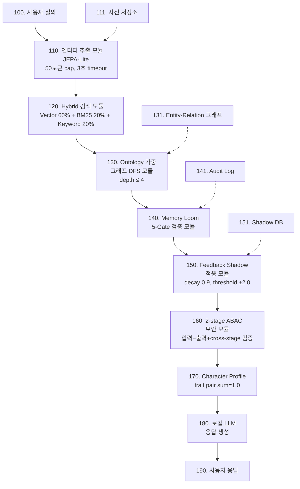
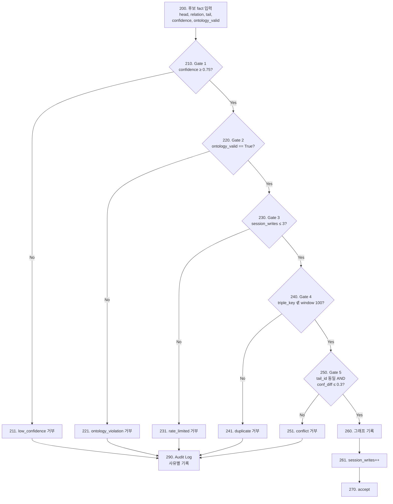

# [임시명세서 초안] Umbrella System + Memory Loom 결합 출원

> 본 문서는 STAGE 1(가장 우선) 임시명세서 작성을 위한 skeleton입니다.
> KIPRIS 전자출원 시 본 문서를 기반으로 PDF·hwp로 전환하여 첨부하십시오.
> 작성 시 [TODO] 마커를 모두 제거·채워주세요.

---

## 발명의 명칭
**로컬 환경에서 안전한 지식 기반 추론 시스템 및 메모리 오염 방지 방법**
(영문: System for Locally-Secure Knowledge-Based Inference with Multi-Gate Memory Validation)

## 출원인
[TODO: 성명 / 주소 / 주민번호 또는 외국인등록번호]

## 발명자
[TODO: 성명 / 주소]

## 공지예외 주장
- 공개일자: 2026-05-05
- 공개매체: GitHub public repository (https://github.com/hashevolution/james-rag-evol)
- 공개주체: 발명자 본인
- 증빙: `docs/patent/disclosure_log.txt`

---

## 1. 기술 분야

본 발명은 인공지능 기반 자연어 질의응답 시스템에 관한 것으로, 보다 구체적으로는 외부 LLM 서비스 호출을 최소화하면서 지식 그래프와 메모리 검증 로직을 결합하여 로컬 환경에서 안전하게 동작하는 추론 시스템 및 그 방법에 관한 것이다.

## 2. 배경 기술

### 2.1 기존 RAG 시스템의 한계
- 단순 벡터 검색만으로는 다중-홉 추론이 어려움
- LLM이 무비판적으로 사실을 메모리에 기록하여 환각·오염이 누적됨
- 클라우드 LLM 호출이 응답 시간·비용·프라이버시 문제를 야기함

### 2.2 그래프 기반 RAG의 한계
- Microsoft GraphRAG 등은 그래프 구축 시 LLM 호출이 과다 (비용 高)
- 메모리에 대한 검증 게이트가 단순(confidence threshold만 적용)
- 입력·검색·출력 단계 간 권한 일관성 검증 부재

## 3. 해결하고자 하는 과제

1. LLM 호출 없이도 키워드를 정확히 확장하여 검색 품질을 유지하는 방법
2. 그래프 메모리에 사실을 기록할 때 다단계 게이트로 오염을 방지하는 방법
3. 사용자 역할에 따라 입력·출력 단계 모두에서 권한 일관성을 검증하는 방법
4. 위 모든 모듈이 협력하는 단일 통합 추론 시스템

## 4. 과제의 해결 수단

### 4.1 시스템 구성 (도면 1 참조)

본 시스템은 다음 7개 모듈을 포함한다:

```
[사용자 질의]
   ↓
(1) 엔티티 추출 모듈 (JEPA-Lite)
    - 사전 + 토큰화 기반 키워드 확장
    - LLM 호출 금지
    - 50 토큰 hard cap
    - 3 초 timeout
   ↓
(2) Hybrid 검색 모듈
    - Vector 60% + BM25 20% + Keyword 20%
   ↓
(3) Ontology 가중 그래프 traversal 모듈
    - DFS 최대 깊이 4
    - score = ontology_weight × confidence
   ↓
(4) Memory Loom 검증 모듈 (도면 2 상세)
    - 5개 순차 게이트
   ↓
(5) Feedback Shadow 적응 모듈
    - 7-type signal × decay 0.9 × threshold ±2.0
   ↓
(6) 2-stage 보안 모듈
    - 입력 prompt-injection 검출
    - 출력 PII / entity 마스킹
    - cross-stage ABAC 검증
   ↓
(7) Character Profile 모듈
    - trait pair sum-invariant rebalance
   ↓
[로컬 LLM 응답 생성]
```

### 4.2 Memory Loom 5-gate 상세 (도면 2 참조)

후보 fact `(head, relation, tail, confidence, ontology_valid)` 가 입력되면:

| Gate | 조건 | 거부 시 사유 코드 |
|------|------|--------------------|
| 1 | `confidence ≥ 0.75` | `low_confidence` |
| 2 | `ontology_valid == True` | `ontology_violation` |
| 3 | `session_write_count ≤ 3` | `rate_limited` |
| 4 | `triple_key NOT IN window(100)` | `duplicate` |
| 5 | `same(head, relation) → tail_diff OR confidence_diff > 0.3 → reject` | `conflict` |

5개 게이트를 모두 통과한 사실만 그래프에 기록되며, 각 거부는 audit log로 보존된다.

상세 구현 (`core/memory_loom.py:80-149` 발췌):

```python
def store(self, result: Dict) -> Tuple[bool, str]:
    # Gate 1: confidence
    confidence = float(result.get("confidence", 0.0))
    if confidence < MEMORY_CONFIDENCE_TH:           # 0.75
        return False, f"Gate1 confidence 미달: {confidence:.3f} < 0.75"

    # Gate 2: ontology_valid
    if not result.get("ontology_valid", False):
        return False, "Gate2 ontology 검증 미통과"

    # Gate 3: write rate 제한
    if self._session_write_count >= MAX_WRITES_PER_SESSION:    # 3
        return False, f"Gate3 session write 한도 초과"

    # Gate 4: dedup (recent 100)
    triple_key = _triple_key(result)
    if triple_key in self._dedup_buffer:            # MEMORY_DEDUP_WINDOW=100
        return False, f"Gate4 중복: triple_key={triple_key}"

    # Gate 5: conflict detection
    base_key = _conflict_base_key(result)
    if base_key in self._conflict_index:
        existing = self._conflict_index[base_key]
        if existing["tail_id"] != result["tail_id"]:
            return False, "Gate5 conflict: tail 불일치"
        if abs(confidence - existing["confidence"]) > 0.3:    # CONFLICT_CONFIDENCE_DIFF
            return False, "Gate5 conflict: confidence 차이 > 0.3"

    # 5개 게이트 모두 통과 → 저장
    self._write(result, triple_key, base_key)
    self._session_write_count += 1
    return True, "저장 완료"
```

### 4.3 데이터 흐름 예시

**예시 1 (정상 저장)**: 후보 fact `{entity_id: e_person_김철수, relation_type: STUDIES, tail_id: e_concept_경제학, confidence: 0.92, ontology_valid: True}` → Gate 1(0.92≥0.75 통과) → Gate 2(ontology 통과) → Gate 3(세션 1/3 통과) → Gate 4(미중복) → Gate 5(충돌 없음) → 저장 성공. 반환 `(True, "저장 완료")`.

**예시 2 (Gate 5 충돌 거부)**: 기존 그래프에 `(김철수, BELONGS_TO, 서울대, conf=0.95)` 가 있을 때, 신규 후보 `(김철수, BELONGS_TO, 연세대, conf=0.88)` 입력 → Gate 1~4 통과 → Gate 5에서 동일 head·relation의 tail이 다르므로(`서울대 ≠ 연세대`) 거부. 반환 `(False, "Gate5 conflict: entity+relation 동일, tail 불일치")`. 양쪽 모두 그래프에 기록되지 않아 모순 누적이 차단된다.

**예시 3 (Gate 1 거부)**: `(김철수, RESEARCHES, 양자컴퓨팅, conf=0.62, ontology_valid=True)` → Gate 1에서 0.62<0.75이므로 즉시 거부. LLM 환각 가능성이 큰 저신뢰 사실의 영구 저장을 차단한다.

---

## 5. 청구항

### 청구항 1 (Independent — 시스템)
로컬 환경에서 안전하게 동작하는 지식 기반 추론 시스템으로서,
- (a) 사전과 토큰화 기반으로 LLM 호출 없이 사용자 질의로부터 키워드를 확장하되, 50 토큰 이하의 hard cap 및 3 초 이내 timeout을 적용하는 엔티티 추출 모듈;
- (b) 벡터 유사도 60%, BM25 20%, 키워드 매칭 20%의 가중치로 hybrid score를 산출하는 검색 모듈;
- (c) entity-relation 그래프에서 ontology weight × confidence를 곱한 score로 최대 깊이 4의 DFS 확장을 수행하는 그래프 traversal 모듈;
- (d) 후보 사실에 대해 (i) confidence ≥ 0.75, (ii) ontology 일관성, (iii) 세션당 쓰기 ≤ 3, (iv) 직전 100건 중복 검사, (v) 동일 head·relation 쌍에서 tail 차이 또는 confidence 차이 > 0.3 거부 — 의 5개 게이트를 순차 적용하여 통과한 사실만 그래프에 기록하는 메모리 검증 모듈;
- (e) N개 사전 정의된 피드백 유형을 0.9 decay 및 ±2.0 threshold로 누적하는 적응 모듈;
- (f) 입력 prompt-injection 검출, 출력 PII / 엔티티 마스킹, 입력→검색→출력 cross-stage ABAC 검증을 수행하는 2-stage 보안 모듈;
- (g) trait pair 합 = 1.0 invariant을 유지하며 한 trait 변경 시 opposing trait를 자동 재조정하는 캐릭터 프로파일 모듈;
을 포함하는 시스템.

### 청구항 2 (Independent — 방법)
청구항 1의 시스템을 이용한 추론 방법으로서,
1. 사용자 질의를 수신하는 단계;
2. 모듈 (a)로 키워드를 확장하는 단계;
3. 모듈 (b)로 후보 문서를 검색하는 단계;
4. 모듈 (c)로 그래프를 확장하여 컨텍스트를 수집하는 단계;
5. 모듈 (d)로 신규 메모리 후보를 검증·기록하는 단계;
6. 모듈 (f)로 출력 응답을 마스킹·검증하는 단계;
7. 로컬 LLM으로 최종 응답을 생성하는 단계;
를 포함하는 방법.

### 청구항 3~10 (Dependent — Memory Loom 세부)
- 청구항 3: Gate 1의 confidence threshold가 0.75인 청구항 1의 시스템.
- 청구항 4: Gate 3의 세션당 쓰기 한도가 3회인 청구항 1의 시스템.
- 청구항 5: Gate 4의 중복 윈도우가 100인 청구항 1의 시스템.
- 청구항 6: Gate 5의 confidence 차이 threshold가 0.3인 청구항 1의 시스템.
- 청구항 7: 게이트별 거부 사유를 audit log에 기록하는 청구항 1의 시스템.
- 청구항 8: triple_key가 (normalize(head), normalize(relation), normalize(tail))의 hash인 청구항 1의 시스템.
- 청구항 9: ontology weight가 다음 표와 같이 정의된 청구항 1의 시스템:

| relation_type | label | weight | sensitive |
|---|---|---|---|
| STUDIES | 공부 | 1.0 | False |
| RESEARCHES | 연구 | 1.0 | False |
| TEACHES | 가르침 | 0.9 | False |
| BELONGS_TO | 소속 | 1.2 | False |
| WORKS_AT | 근무 | 1.1 | False |
| FOUNDED_BY | 설립 | 1.0 | False |
| IS_A | 분류 | 1.1 | False |
| PART_OF | 구성 | 1.0 | False |
| RELATED_TO | 관련 | 0.7 | False |
| PRODUCES | 생산 | 1.0 | False |
| OPERATES_IN | 산업 | 0.8 | False |
| BELONGS_TO_INDUSTRY | 분야 | 0.8 | False |
| HAS_SECRET / KNOWS_PASSWORD / HAS_CREDENTIAL / OWNS_PRIVATE | 민감 | 0.0 | **True (그래프 traversal에서 차단)** |
- 청구항 10: feedback 유형 N=7이며 각 유형이 [-1.0, +1.0] 가중치를 갖는 청구항 1의 시스템.

[TODO: 종속항을 더 추가하여 보호 범위를 두텁게 해도 좋습니다. 임시명세서는 청구항 형식 강제 없으므로 자유 서술도 가능.]

---

## 6. 도면

### 도면 1 — 시스템 전체 아키텍처

KIPRIS 출원용 PDF로 변환할 mermaid 소스 (draw.io / excalidraw 등으로 다시 그려도 무방):



### 도면 2 — Memory Loom 5게이트 흐름도



---

## 7. 도면의 간단한 설명

- 도면 1: 본 발명에 따른 추론 시스템의 전체 구성도
- 도면 2: Memory Loom 5게이트 검증 흐름도

## 8. 부호의 설명

| 부호 | 명칭 |
|------|------|
| 100 | 사용자 질의 입력부 |
| 110 | 엔티티 추출 모듈 (JEPA-Lite) |
| 111 | 동의어/확장 사전 저장소 |
| 120 | Hybrid 검색 모듈 |
| 130 | Ontology 가중 그래프 traversal 모듈 |
| 131 | Entity-Relation 그래프 |
| 140 | Memory Loom 5-Gate 검증 모듈 |
| 141 | Audit Log 저장소 |
| 150 | Feedback Shadow 적응 모듈 |
| 151 | Shadow DB (방향별 누적 점수) |
| 160 | 2-stage ABAC 보안 모듈 |
| 170 | Character Profile 모듈 |
| 180 | 로컬 LLM 추론기 |
| 190 | 사용자 응답 출력부 |
| 200 | 후보 fact 입력부 |
| 210 | Gate 1 (confidence threshold) |
| 220 | Gate 2 (ontology validity) |
| 230 | Gate 3 (session write rate) |
| 240 | Gate 4 (dedup window) |
| 250 | Gate 5 (conflict detection) |
| 260 | 그래프 기록부 |
| 261 | 세션 쓰기 카운터 |
| 270 | 통과 종료점 |
| 211, 221, 231, 241, 251 | 게이트별 거부 분기 |
| 290 | 거부 사유 기록 (Audit Log 연결) |

---

## 9. 발명을 실시하기 위한 구체적인 내용

### 9.1 모듈 (a) — JEPA-Lite 엔티티 추출 (`core/jepa_adapter.py`)

**상수**:
- `JEPA_TOKEN_HARD_LIMIT = 50` — 확장 후 token 최대 개수
- `JEPA_TIMEOUT_SEC = 3.0` — 이 안에 못 끝내면 원본 query 반환

**핵심 흐름**:
```python
def expand(query: str) -> str:
    t_start = time.time()
    tokens = _tokenize_simple(query)         # 1단계: 사전 + 정규식 토크나이징
    if time.time() - t_start > JEPA_TIMEOUT_SEC:
        return query                          # timeout 시 bypass

    expanded_tokens = _expand_keywords(tokens)  # 2단계: 동의어 사전 확장 (LLM 없음)
    if time.time() - t_start > JEPA_TIMEOUT_SEC:
        return query

    truncated = _hard_truncate(expanded_tokens, JEPA_TOKEN_HARD_LIMIT)  # 3단계: hard cap
    final_tokens = _tokenize_simple(query + " " + " ".join(truncated[:10]))
    if len(final_tokens) > JEPA_TOKEN_HARD_LIMIT:
        return " ".join(final_tokens[:JEPA_TOKEN_HARD_LIMIT])  # 4단계: 최종 cap 재적용
    return expanded_query
```

**핵심 차별점**:
- `_SYNONYM_MAP` (`core/jepa_adapter.py:28-47`): 학문/조직/관계/일반 4그룹의 한국어 동의어 사전. 약 17개 표제어, 각 2~3개 확장어. LLM 호출 0회.
- `_STOPWORDS` (`core/jepa_adapter.py:49-53`): 한국어 조사·어미 제거.
- 4단계 모든 곳에서 **2회의 timeout 검사** + **2회의 hard truncate 검사** = 어떠한 입력에도 3초 이내 / 50 토큰 이내 보장.

### 9.2 모듈 (d) — Memory Loom (`core/memory_loom.py:80-149`)

§4.2 참조. 핵심 상수는 다음과 같다:

```python
MAX_WRITES_PER_SESSION   = 3       # Gate 3 한도
MEMORY_CONFIDENCE_TH     = 0.75    # Gate 1 임계값
MEMORY_DEDUP_WINDOW      = 100     # Gate 4 윈도우
CONFLICT_CONFIDENCE_DIFF = 0.3     # Gate 5 confidence 차이 임계값
```

`_triple_key()` 는 `entity_id::relation_type::tail_id` 합성 키이며, 누락 필드는 `text[:100]` 의 MD5 hash로 fallback (`core/memory_loom.py:44-58`). `_conflict_base_key()` 는 tail_id를 제외한 `entity_id::relation_type` 키로 충돌 판정 인덱스에 사용된다 (`core/memory_loom.py:61-63`).

자가 검증 테스트 (`core/memory_loom.py:200-267`)는 5개 게이트 각각 + 정상 저장 경로를 모두 커버한다.

### 9.3 모듈 (b) — Hybrid 검색

`core/retrieval_engine.py` 와 `core/rag_engine.py` 가 협력하여 다음 가중 hybrid score를 산출:

```
score = 0.6 × cosine_similarity(query_emb, doc_emb)
      + 0.2 × BM25(query_tokens, doc_tokens)
      + 0.2 × keyword_overlap(query_keywords, doc_keywords)
```

상위 K개 문서 + 그 안의 entity_id 들이 모듈 (c)로 전달된다.

### 9.3 모듈 (c) — Ontology 가중 그래프 DFS (`core/graph_engine.py:220-307`)

**상수**:
```python
CONFIDENCE_THRESHOLD = 0.6      # 관계 traversal 최소 confidence
MAX_DEPTH            = 4        # DFS 최대 깊이
DFS_SCORE_THRESHOLD  = 0.05     # ACT halting 점수 임계
DEPTH_DECAY          = 0.7      # 깊이당 점수 감쇠
```

**핵심 흐름**:
```python
def dfs(eid, d, path, parent_score):
    if d > MAX_DEPTH or eid in visited: return
    relations = entity["relations"]
    base_score    = compute_graph_score(relations, depth=max(d, 1))
    decayed_score = base_score * (DEPTH_DECAY ** d)
    if d > 0 and decayed_score < DFS_SCORE_THRESHOLD:
        return                                  # ACT halting
    for rel in relations:
        if rel.confidence < CONFIDENCE_THRESHOLD: continue
        if is_sensitive_relation(rel.type):     continue   # sensitive=True 차단
        if not check_strict_relation(...):      continue   # 타입 제약
        dfs(rel.target_id, d+1, path+rel, decayed_score)
```

`compute_graph_score()` 는 `Σ(weight × confidence) / depth` 로 계산하며 sensitive relation은 제외 (`core/ontology.py:70-79`).

### 9.3 모듈 (e) — Feedback Shadow (`core/feedback_engine.py:35-151`)

**7-type signal + decay + threshold**:
```python
FEEDBACK_SIGNALS = {
    "explicit_positive":  +1.0,   "flow_continue":    +0.3,
    "implicit_positive":  +0.2,   "explicit_negative":-1.0,
    "correction":         -0.8,   "strong_objection": -0.6,
    "implicit_negative":  -0.3,
}
REINFORCE_TH = +2.0   # 강화 임계
WEAKEN_TH    = -2.0   # 약화 임계
DECAY        = 0.9    # 직전 누적값 감쇠

def accumulate(direction_id, signal, query):
    delta     = FEEDBACK_SIGNALS[signal]
    new_score = (self._shadow[direction_id] + delta) * DECAY
    self._shadow[direction_id] = new_score
    if new_score >= REINFORCE_TH:
        self._apply_reinforce(...); self._shadow[direction_id] = 0.0
    elif new_score <= WEAKEN_TH:
        self._apply_weaken(...);    self._shadow[direction_id] = 0.0
```

`direction_id` 는 (mode, query_topic_hash) 합성 키로, 한 사용자의 동일 응답 방향을 추적한다.

### 9.3 모듈 (f) — 2-stage 보안 + cross-stage ABAC (`core/security_layer.py`)

**Stage 1 (입력 단계)** `pre_check()` (`core/security_layer.py:323-362`): `validate_input()` → `detect_attack()` (prompt injection 정규식) → `extract_data_only()` (instruction isolation) → `_sanitize_query()` (ATTACK_PATTERNS + ATTACK_REGEX 치환).

**Stage 2 (출력 단계)** `filter_answer_by_role()` + `mask_sensitive()` (`core/security_layer.py:253-316`): 10개 PII 정규식 패턴 (주민번호·전화·이메일·비밀번호·API key·secret·token·카드번호·계좌·내부코드) + 역할별 차단 키워드 사전 + person entity 이름 마스킹.

**Cross-stage ABAC** `cross_stage_abac_verify()` (`core/security_layer.py:169-224`): Vector → Graph → Output 3단계에서 동일 ABAC 정책이 일관되게 적용됐는지 사후 검증, 위반 시 `violations` 리스트 + audit log 기록.

### 9.3 모듈 (g) — Character Profile (`core/character_profile.py:17-66`)

**11개 trait 구성**:
- 그룹 A pair: curiosity ↔ focus
- 그룹 B pair: caution ↔ boldness
- 그룹 C pair: analytical ↔ intuitive
- 그룹 D pair: independent ↔ collaborative
- 그룹 E (independent): security, creativity, empathy

**Sum-invariant rebalance** (`core/character_profile.py:55-66`):
```python
def set_trait(self, trait_id, value):
    value = max(0.0, min(1.0, value))
    self._values[trait_id] = value
    opp = _OPPONENTS.get(trait_id)              # 같은 그룹 상대 trait
    if opp:                                      # E 그룹은 opp 없음
        self._values[opp] = round(1.0 - value, 3)
```

**Threshold prompt directive** (`core/character_profile.py:68-97`): trait > 0.7 → 강한 directive 주입, trait < 0.3 → 반대 방향 directive 주입.

---

## 10. 산업상 이용 가능성

본 발명은 기업·공공기관 내부의 폐쇄망 챗봇, 의료·법률 상담, 군용 정보 시스템 등 외부 LLM 호출이 제한되거나 데이터 유출 위험이 큰 환경에서 안전한 지식 기반 추론을 제공하는 데에 산업상 이용 가능하다.

---

## 11. 명세서 작성 체크리스트

- [ ] 모든 [TODO] 제거
- [ ] 도면 2매 PDF 첨부
- [ ] 출원인 정보 기재
- [ ] 공지예외 주장서 첨부
- [ ] disclosure_log.txt 첨부
- [ ] KIPRIS 전자출원 → 출원번호 수령
- [ ] 출원확인서 PDF 보관 → `docs/patent/stage1-receipt.pdf`
